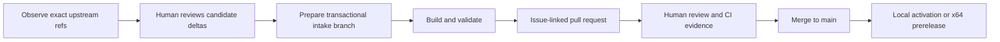

<div align="center">

# Sf-Cor-Dev

**A review-first downstream Stockfish workspace for applying selected CorChess changes to exact official Stockfish revisions.**

[](https://github.com/ralabarta/Sf-Cor-Dev/actions/workflows/compatibility.yml)
[](Copying.txt)

[Quick start](#quick-start) · [Trust model](#trust-model) · [Upstream sources](#upstream-sources) · [Local updates](#native-local-updates) · [Prereleases](#linux-and-windows-x64-prereleases)

</div>

Sf-Cor-Dev is source-bearing infrastructure, not an automatic updater or an independent chess-engine project. It pins immutable upstream commits, accepts only a human-reviewed ordered CorChess delta manifest, validates each candidate, and keeps automation non-authoritative. The engine remains Stockfish-derived software and does not include a graphical chess interface.

> [!IMPORTANT]
> Scheduled monitoring only observes the two declared upstream refs. It never chooses CorChess deltas, edits manifests, creates branches or pull requests, pushes commits, merges changes, or publishes releases.

## How it works



The workflow deliberately separates **observation**, **selection**, **validation**, and **delivery**. A passing script or GitHub Actions run produces evidence; it does not grant merge or release authority.

## Quick start

Requirements include Git, POSIX shell tooling, Python 3, GNU Make, a compatible C++ compiler, `curl`, `sha256sum`, and ripgrep (`rg`). The local native build also requires `getconf`.

```sh
git clone https://github.com/ralabarta/Sf-Cor-Dev.git
cd Sf-Cor-Dev

tests/tooling/run.sh
scripts/nnue-prefetch.sh manifests/nnue.json
scripts/build.sh manifests/nnue.json
scripts/validate.sh local-review-1
```

Use a unique validation run ID containing only letters, digits, `.`, `_`, and `-`. Validation requires a clean committed source tree, reserves each source/run identity once, and writes evidence to:

```text
evidence/<source-sha>/<run-id>/
```

The default build is portable `x86-64`. It is staged away from `src/`, uses only the checksum-verified cached NNUE during compilation, and publishes the executable as `build/stockfish`.

## Trust model

| Boundary | Enforced behavior |
| --- | --- |
| Source identity | Full 40-character commits are pinned in reviewed manifests and checked against exact tracked refs. |
| CorChess selection | `manifests/corchess-deltas.json` must be explicitly reviewed, ordered, and bound to the pinned official and CorChess commits. Every patch has a declared SHA-256. |
| Intake | `scripts/intake.sh` reconstructs the complete candidate in temporary repositories, rejects conflicts or invalid ancestry, and publishes only a deterministic `integrate/<manifest-sha256>` branch. |
| NNUE | The network URL, filename, and SHA-256 are pinned. Builds consume a verified cache object rather than downloading during compilation. |
| Validation | Provenance, NNUE, build, UCI, bench, perft, reprosearch, and smoke gates run in order. Missing, malformed, oversized, or failed evidence closes the gate. |
| Automation authority | Compatibility and monitoring workflows are evidence-only. Their records explicitly carry `authority: none` and `merge_authorized: false`. |
| Activation | A validated binary is copied into an immutable, identity-named user-local version directory before atomic symlink switching. |
| Release provenance | Linux and Windows artifacts are built from one reviewed SHA on `main` ancestry and one NNUE identity, checksummed, joined, and re-verified before publication. |

Human review remains mandatory. Repository policy—not a script, status badge, or evidence file—decides whether a pull request may merge or a prerelease may publish. This README does not assert that branch protection is currently enabled.

## Upstream sources

The authoritative source locations and operational refs are fixed by [`manifests/upstreams.json`](manifests/upstreams.json):

| Source | Repository | Operational ref |
| --- | --- | --- |
| Official Stockfish | [`official-stockfish/Stockfish`](https://github.com/official-stockfish/Stockfish) | `refs/heads/master` |
| CorChess | [`IIvec/Stockfish` — `corchess`](https://github.com/IIvec/Stockfish/tree/corchess) | `refs/heads/corchess` |

The manifest also records the currently reviewed full commit for each source. Do not infer CorChess state from the repository default branch, a moving `HEAD`, a tag, or a release page.

### Observational monitoring

[`.github/workflows/upstream-intake.yml`](.github/workflows/upstream-intake.yml) runs every 15 minutes and can also be dispatched manually. It executes:

```sh
scripts/discover.sh manifests/upstreams.json
```

The observer classifies each pinned ref as `unchanged`, `advanced`, `diverged`, or `invalid`. Any drift fails visibly so a maintainer can begin review. The schedule never auto-selects deltas, mutates manifests, pushes, or opens a pull request.

### Reviewed intake

After a maintainer has reviewed and updated both upstream identities and the ordered delta queue, start intake from a clean, attached branch:

```sh
scripts/intake.sh manifests/upstreams.json manifests/corchess-deltas.json
```

For each selected CorChess commit, intake verifies single-parent shape, ancestry under the pinned CorChess commit, and the exact binary patch checksum. It applies the complete queue away from the caller's worktree first. A conflict requires human resolution; the script does not guess or leave a partial integration branch.

An unchanged, already-valid integration branch reports `no changes`.

## Build and validation

### Tooling tests

```sh
tests/tooling/run.sh
```

The runner executes every executable suite declared in [`tests/tooling/suites.list`](tests/tooling/suites.list), including intake, ancestry, NNUE, gate, activation, local-update, workflow, and prerelease coverage.

### Portable build and complete gate sequence

```sh
scripts/nnue-prefetch.sh manifests/nnue.json
scripts/build.sh --profile portable manifests/nnue.json
scripts/validate.sh local-review-2
```

Equivalent short form for the default profile:

```sh
scripts/build.sh manifests/nnue.json
```

Validation runs these gates in order:

```text
provenance → NNUE → build → UCI → bench → perft → reprosearch → smoke
```

Bench expectations are human-owned in [`manifests/bench.json`](manifests/bench.json) and must retain pinned commit provenance. Automation does not rewrite them.

## Native local updates

The repository-owned updater is the canonical local command:

```sh
scripts/update-local.sh
```

An optional run ID may be supplied:

```sh
scripts/update-local.sh local-20260902
```

The updater pins the current committed source and CorChess-manifest identities, verifies the NNUE cache, runs the complete gate sequence using the `local` build profile, checks that source identity did not change, and activates only the validated candidate. The local profile uses `ARCH=native`, `profile-build`, and parallelism reported by `getconf _NPROCESSORS_ONLN`.

The current maintainer workstation also has a thin `update-sf-cor-dev.sh` convenience wrapper that only executes the repository script and forwards its arguments. This wrapper is machine-specific and outside the repository; it adds no validation or authority. Always treat `scripts/update-local.sh` as the maintained implementation.

### Atomic activation and rollback

Manual activation requires the candidate, committed source SHA, and SHA-256 of the reviewed CorChess delta manifest:

```sh
source_sha=$(git rev-parse HEAD)
manifest_sha=$(sha256sum manifests/corchess-deltas.json | cut -d ' ' -f 1)
scripts/activate.sh "$PWD/build/stockfish" "$source_sha" "$manifest_sha"
```

Activation is unprivileged and stored under `${XDG_DATA_HOME:-$HOME/.local/share}/sf-cor-dev/`. Each retained version is immutable and checksum-verified. `current` is switched atomically; a displaced current version becomes `previous`.

```sh
scripts/rollback.sh
```

Rollback validates both retained versions and atomically swaps `current` and `previous`. If build, validation, or switching fails, the active version is not replaced.

## Linux and Windows x64 prereleases

[`.github/workflows/prerelease.yml`](.github/workflows/prerelease.yml) is a manual, draft-first development prerelease workflow. It requires:

- a full reviewed commit SHA that is present on `main` ancestry;
- a `dev-*` prerelease tag;
- a retained known-good `dev-*` rollback target;
- an explicit publication switch, disabled by default.

The workflow builds deterministic packages from the same reviewed SHA and NNUE identity:

| Platform | Runner | Artifact |
| --- | --- | --- |
| Linux x64 | `ubuntu-24.04` | `stockfish-linux-x86-64.tar.gz` |
| Windows x64 | `windows-2022` with MSYS2 UCRT64 | `stockfish-windows-x86-64.zip` containing `stockfish.exe` |

Platform metadata is joined by `scripts/release-evidence.sh`. Before promotion, the workflow creates a draft, downloads every asset again, checks the source and NNUE identities, verifies the exact asset set and SHA-256 values, and only then removes draft status. Cleanup of older development releases follows the validated release plan while retaining the declared rollback target.

> [!NOTE]
> Windows execution requires evidence from the Windows GitHub Actions job. Linux or local shell validation must not be presented as Windows runtime proof. Releases come only from reviewed `main` SHAs; this workflow's existence does not imply that a release has been published.

## GitHub delivery workflow

The operational delivery tracker is [issue #1: Complete operational Stockfish-CorChess delivery](https://github.com/ralabarta/Sf-Cor-Dev/issues/1). For this project and future changes:

1. **Issue** — describe the goal, acceptance criteria, risks, rollback, and data-safety considerations.
2. **Branch** — create a focused branch from the intended reviewed base and keep unrelated changes out.
3. **Pull request** — link the issue and identify the exact source SHA, manifest changes, validation run, and rollback path.
4. **Review** — inspect the source and human-owned expectations; treat [compatibility evidence](.github/workflows/compatibility.yml) as non-authoritative supporting evidence.
5. **Merge** — merge only under the repository's current human review and branch policy.
6. **Delivery** — from the reviewed `main` SHA, explicitly choose local activation or the manual prerelease workflow.

Do not equate a green check with approval. The compatibility workflow can run on pull requests and pushes to `main`, uses read-only repository permissions, retains available evidence for 14 days, and cannot merge, approve, publish, alter manifests, or grant authority.

## Repository layout

| Path | Purpose |
| --- | --- |
| [`src/`](src/) | Stockfish-derived engine source and build system. |
| [`manifests/`](manifests/) | Reviewed upstream, CorChess delta, NNUE, and bench identities. |
| [`scripts/`](scripts/) | Discovery, intake, NNUE, build, validation, activation, rollback, and release-evidence tooling. |
| [`tests/tooling/`](tests/tooling/) | Owned integration and contract tests for the operational toolchain. |
| [`.github/workflows/`](.github/workflows/) | Non-authoritative compatibility, scheduled observation, and manual prerelease workflows. |
| [`README.stockfish.md`](README.stockfish.md) | Preserved upstream Stockfish overview, usage, and build guidance. |
| [`CONTRIBUTING.md`](CONTRIBUTING.md) | Upstream Stockfish contribution and code-style guidance. |
| [`Copying.txt`](Copying.txt) | GNU General Public License version 3. |
| `build/` | Generated local build output; not a source of authority. |
| `evidence/` | Generated validation evidence keyed by source SHA and run ID. |

## Security and reporting

- For reproducible public defects in this downstream workflow, use the repository's [bug report form](https://github.com/ralabarta/Sf-Cor-Dev/issues/new?template=BUG-REPORT.yml). Include the full source SHA, manifest digests, platform, command, failing gate, and sanitized evidence path.
- Do not post credentials, private URLs, tokens, personal data, proprietary source, or sensitive vulnerability details in an issue or log.
- For a vulnerability that could put users at risk, use GitHub's private vulnerability-reporting channel if it is available for this repository; otherwise contact the repository owner privately before public disclosure.
- Report engine behavior or upstream Stockfish defects to the appropriate upstream project after confirming they are not introduced by the downstream integration.

## Contributing

Start with an issue before changing intake, trust boundaries, manifests, validation expectations, activation, or release behavior. Keep commits reviewable, preserve source and patch provenance, add focused tooling tests for operational changes, and run:

```sh
tests/tooling/run.sh
env gga
git diff --check
```

Changes to Stockfish C++ source should also follow the upstream guidance in [`CONTRIBUTING.md`](CONTRIBUTING.md), including applicable formatting and Fishtest requirements. Never update a bench value solely to make validation pass.

## Limitations

- Upstream compatibility is not automatic; divergent refs, conflicting deltas, or changed behavior require human analysis.
- Scheduled monitoring observes only the exact refs declared in `manifests/upstreams.json`.
- Validation proves the configured gates for one source and environment; it is not a proof of chess strength, universal platform compatibility, or defect-free software.
- The native local updater targets Unix-like hosts with the required POSIX/GNU tooling. It is not the Windows validation path.
- Automatic merge, signing, attestations, and autonomous release selection are out of scope.
- Sf-Cor-Dev includes no GUI. Use a compatible UCI chess interface to run the engine interactively.

## License and attribution

Sf-Cor-Dev contains Stockfish-derived source and is distributed under the [GNU General Public License version 3](Copying.txt). When distributing a binary, provide the corresponding complete source—or a durable pointer to the exact source used to build it—and preserve the GPL notices.

Stockfish is developed by the [Stockfish contributors](https://github.com/official-stockfish/Stockfish). CorChess source is maintained in [`IIvec/Stockfish`](https://github.com/IIvec/Stockfish/tree/corchess). See [`AUTHORS`](AUTHORS) and [`README.stockfish.md`](README.stockfish.md) for upstream authorship, acknowledgements, usage, and project links.
