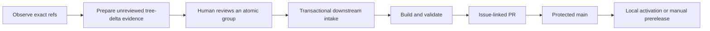

<div align="center">

# Sf-Cor-Dev

**A review-first workspace for applying selected CorChess changes to exact official Stockfish revisions.**

[](https://github.com/ralabarta/Sf-Cor-Dev/actions/workflows/compatibility.yml)
[](Copying.txt)

[Choose your path](#choose-your-path) · [Install and verify](#install-build-and-verify) · [Native updates](#native-local-updates) · [Maintainer checklist](#maintainer-checklist)

</div>

Sf-Cor-Dev is source-bearing integration infrastructure, not an automatic updater or an independent engine. It binds reviewed CorChess deltas, NNUE data, and validation evidence to immutable commits, while leaving selection, approval, merge, activation, and release decisions with people. The resulting engine is Stockfish-derived and uses the UCI protocol; no graphical interface is included.

> [!IMPORTANT]
> Scheduled monitoring is read-only. On valid forward drift it prepares and uploads a deterministic **unreviewed** candidate bundle, then fails visibly for maintainer review. It never selects a delta, changes a reviewed manifest, creates or merges a pull request, pushes a commit, updates bench authority, activates a binary, or publishes a release.

## How it works



The lifecycle intentionally separates **observation**, **selection**, **verification**, and **delivery**. CI and release workflows are provider-independent and produce evidence; GGA runs on the maintainer or pre-commit side. Human review remains mandatory, and automated evidence does not grant merge or release authority.

### Public status snapshot

Verified against GitHub on 2026-09-02:

| Surface | Current state |
| --- | --- |
| Default branch | `main` |
| Branch protection | Enabled; strict required `compatibility` check, admin enforcement, and one approving review |
| Compatibility workflow | Latest `main` run passed; the badge above reflects live state |
| Published releases | None |
| Historical delivery | [PR #2](https://github.com/ralabarta/Sf-Cor-Dev/pull/2) merged the initial operational delivery tracked by closed issue #1 |

This snapshot can age. Check the linked workflow and the repository's [releases](https://github.com/ralabarta/Sf-Cor-Dev/releases) before making an operational decision.

## Choose your path

| I want to… | Start here |
| --- | --- |
| Build and evaluate the engine | [Install, build, and verify](#install-build-and-verify) |
| Keep a validated native binary on my workstation | [Native local updates](#native-local-updates) |
| Review or update upstream integration | [Upstream-update runbook](#upstream-update-runbook) |
| Contribute a focused change | [GitHub delivery workflow](#github-delivery-workflow) |
| Prepare a development prerelease | [Linux and Windows x64 prereleases](#linux-and-windows-x64-prereleases) |
| Diagnose a failed operation | [Failure and rollback decisions](#failure-and-rollback-decisions) and [Troubleshooting](#troubleshooting) |

## Install, build, and verify

### Requirements

A Unix-like environment with Git, a POSIX shell, Python 3, GNU Make, a compatible C++ compiler, `curl`, `sha256sum`, `expect`, and ripgrep (`rg`). Native local builds additionally require `getconf`; the complete tooling suite requires Python's `yaml` module.

### Quick installation

```sh
git clone https://github.com/ralabarta/Sf-Cor-Dev.git
cd Sf-Cor-Dev
scripts/nnue-prefetch.sh manifests/nnue.json
scripts/build.sh manifests/nnue.json
```

The default `portable` profile builds `ARCH=x86-64` in an isolated staging directory and writes the executable to `build/Sf-Cor-Dev`. Compilation consumes only the checksum-verified NNUE cache; it does not download network data during the build.

### First verification

```sh
printf 'uci\nisready\nquit\n' | build/Sf-Cor-Dev
scripts/validate.sh first-verification
```

The first command should include `uciok` and `readyok`. The second requires a clean, committed source tree and runs the complete compatibility sequence. A run ID may contain letters, digits, `.`, `_`, and `-`, but cannot begin with `.` or contain `..`.

For the repository-owned tooling contracts:

```sh
tests/tooling/run.sh
```

## Upstream sources

[`manifests/upstreams.json`](manifests/upstreams.json) is authoritative for source identity:

| Source | Repository | Required ref |
| --- | --- | --- |
| Official Stockfish | [`official-stockfish/Stockfish`](https://github.com/official-stockfish/Stockfish) | `refs/heads/master` |
| CorChess | [`IIvec/Stockfish` branch `corchess`](https://github.com/IIvec/Stockfish/tree/corchess) | `refs/heads/corchess` |

The manifest records a reviewed 40-character commit for each ref. The current baseline is official `47be34c55fbc86079cba57b9ad6955e6fe0bdff9` and CorChess `a053bea332281575e3c9e144dcfdd67281ffef05`, with the official commit as their exact merge-base. Never infer CorChess state from the repository's default `HEAD`, a tag, or a release page.

### Observation versus intake

[Observe exact upstream refs](.github/workflows/upstream-intake.yml) runs every 15 minutes and on manual dispatch with read-only contents permission:

```sh
scripts/discover.sh manifests/upstreams.json
```

It classifies each exact ref as `unchanged`, `advanced`, `diverged`, or `invalid`. Unchanged refs pass. Valid forward drift runs `scripts/prepare-candidate.sh`, uploads byte-deterministic unreviewed exact-ref/merge-base/path/blob/patch-digest evidence, and then fails visibly. Diverged or invalid identity fails without a candidate. The workflow never invokes intake or writes reviewed repository state.

### Upstream-update runbook

1. Run discovery and inspect both exact refs.
2. Prepare the deterministic unreviewed tree-delta bundle and inspect its exact evidence:

   ```sh
   scripts/prepare-candidate.sh candidate-bundle manifests/upstreams.json
   ```

3. Review complete interacting path groups. Promote only accepted groups to schema 2 in [`manifests/corchess-deltas.json`](manifests/corchess-deltas.json); never copy `reviewed: false` automation output into authority without review.
4. From a clean, attached downstream branch, reconstruct the candidate:

   ```sh
   scripts/intake.sh manifests/upstreams.json manifests/corchess-deltas.json
   ```

5. Inspect the deterministic `integrate/<manifest-sha256>` branch. A repeated valid intake may report `no changes`.
6. Run the tooling suite, NNUE prefetch, portable build, and compatibility validation.
7. Run the maintainer-side GGA check, then open an issue-linked pull request with provenance, evidence, risks, and rollback details.

Schema-2 intake regenerates every selected path patch from the exact official and CorChess trees, verifies the exact merge-base, regular-file modes, base/CorChess blobs, path and atomic-group SHA-256 values, and rejects unsafe, overlapping, unsorted, partial, or tampered groups. It starts from the caller's downstream `HEAD`, requires each selected engine path to equal the official base, and changes only the complete reviewed group. Temporary construction and transactional publication preserve Sf-Cor-Dev tooling and history. Schema 1 remains supported for older reviewed commit queues.

## Manifest and provenance model

| File | Human-owned decision | Machine verification |
| --- | --- | --- |
| [`manifests/upstreams.json`](manifests/upstreams.json) | Exact official and CorChess commits and refs | Ref identity and relationship to observed commits |
| [`manifests/corchess-deltas.json`](manifests/corchess-deltas.json) | Complete accepted schema-2 atomic path groups (or legacy schema-1 commits) | Merge-base, safe unique paths, group completeness, exact blobs, and canonical patch SHA-256 |
| [`manifests/nnue.json`](manifests/nnue.json) | Network filename, HTTPS source, and SHA-256 | Safe cache path and content digest before build |
| [`manifests/bench.json`](manifests/bench.json) | Expected bench nodes and source/baseline commits | Pinned upstream `Bench:` provenance and observed node count |

Validation hashes all four manifests and records them with the committed source SHA in `provenance.json`. Bench authority is intentionally separate: only a later reviewed `manifests/bench.json` change may bind repeated deterministic bench output to an existing committed engine-source SHA and its truthful `Bench:` footer. Candidate preparation never infers or rewrites bench values. Do not change a pinned identity or expected bench value merely to make a failing gate pass; review and explain the upstream cause.

## Build and validation

### Compatibility gates

```sh
scripts/nnue-prefetch.sh manifests/nnue.json
scripts/build.sh --profile portable manifests/nnue.json
scripts/validate.sh review-20260902
```

`portable` is the default, so `scripts/build.sh manifests/nnue.json` is equivalent. Validation executes and verifies this fail-closed chain:

```text
provenance → NNUE → build → UCI → bench → perft → reprosearch → smoke
```

Evidence is written under `evidence/<source-sha>/<run-id>/`. A successful run contains:

- `provenance.json` with source and manifest identities;
- ordered `results/*.json` records linked by predecessor SHA-256;
- bounded `logs/*.log` output for each gate;
- `summary.json` with `status: pass`, `authority: none`, and `merge_authorized: false`.

On pull requests and pushes to `main`, [Compatibility evidence (non-authoritative)](.github/workflows/compatibility.yml) reproduces the portable sequence on `ubuntu-24.04`. Its artifact is named `compatibility-evidence-<source-sha>-<run-id>-<attempt>` and retained for 14 days. The workflow has read-only contents permission and cannot approve, merge, publish, or change manifests.

### Tooling tests

```sh
tests/tooling/run.sh
```

The runner executes every executable suite in [`tests/tooling/suites.list`](tests/tooling/suites.list), covering the runner, ancestry, deterministic candidate preparation, schema-1/schema-2 intake, NNUE handling, local updates, gates, activation, prerelease evidence, and workflow contracts.

## Native local updates

The maintained native updater is [`scripts/update-local.sh`](scripts/update-local.sh):

```sh
scripts/update-local.sh
# Or choose the evidence identity:
scripts/update-local.sh local-20260902
```

It pins the current committed source and CorChess-manifest SHA-256, clears inherited gate overrides, verifies the NNUE cache, validates one absolute candidate with the `local` profile, confirms that `HEAD` did not move, and activates only that candidate. The local profile uses `ARCH=native`, `profile-build`, and `getconf _NPROCESSORS_ONLN` parallelism.

Activation is unprivileged. State lives at:

```text
${XDG_DATA_HOME:-$HOME/.local/share}/sf-cor-dev/
├── activation.lock
├── current  -> versions/<source-sha>-<manifest-sha256>/stockfish
├── previous -> versions/<source-sha>-<manifest-sha256>/stockfish
└── versions/
```

Version directories and checksums are immutable after installation, and `current` switches atomically. Public candidates are named `build/Sf-Cor-Dev`, while immutable version storage intentionally remains `stockfish` so an already-active legacy version stays readable. For a second activation, first merge and verify the committed candidate on protected `main`; then run the updater and confirm `current` selects the new source identity and `previous` still selects the known-good prior version before testing rollback. Any workstation convenience wrapper should only delegate to this repository-owned script; it is not part of the trust boundary.

### Manual activation and rollback

```sh
source_sha=$(git rev-parse HEAD)
manifest_sha=$(sha256sum manifests/corchess-deltas.json | cut -d ' ' -f 1)
scripts/activate.sh "$PWD/build/Sf-Cor-Dev" "$source_sha" "$manifest_sha"
```

```sh
scripts/rollback.sh
```

Rollback verifies both retained versions, then atomically swaps `current` and `previous`. It fails without changing the active binary if either retained version is absent or invalid.

## Failure and rollback decisions

| Observation | Do this | Do not do this |
| --- | --- | --- |
| Discovery reports `advanced` | Review new commits and deliberately update manifests | Auto-select every new CorChess commit |
| Discovery reports `diverged` or `invalid` | Stop and verify the exact ref and pinned ancestry | Infer state from default `HEAD` |
| Intake reports a conflict | Review the complete queue and revise the manifest or source choice | Resolve blindly or keep a partial branch |
| A validation gate fails | Read its bounded log and result record; fix the cause, then use a new run ID | Rewrite bench or provenance to force green |
| Local build or validation fails | Keep the existing `current`; no activation occurred | Copy the failed candidate over the active binary |
| Activation fails | Inspect permissions, lock state, and retained checksums; `current` remains unchanged | Edit immutable version directories in place |
| Newly activated engine regresses | Run `scripts/rollback.sh` | Delete `previous` before recovery |
| Prerelease evidence differs by platform | Stop publication and inspect source, NNUE, artifact names, and digests | Treat Linux evidence as Windows runtime proof |

## Linux and Windows x64 prereleases

[Draft development prerelease](.github/workflows/prerelease.yml) is a manual, provider-independent workflow. Its inputs are a full reviewed SHA on `main`, a new `dev-*` tag, a retained known-good `dev-*` rollback target, and the `execute_publication` switch, which defaults to `false`.

| Platform | Runner | Package |
| --- | --- | --- |
| Linux x64 | `ubuntu-24.04` | `Sf-Cor-Dev-linux-x86-64.tar.gz` containing `Sf-Cor-Dev` |
| Windows x64 | `windows-2022`, MSYS2 UCRT64 | `Sf-Cor-Dev-windows-x86-64.zip` containing `Sf-Cor-Dev.exe` |

Both jobs bind the same source SHA and NNUE identity. [`scripts/release-evidence.sh`](scripts/release-evidence.sh) joins their metadata and produces `checksums.sha256`, `release-evidence.json`, and `release-notes.md`; the validated workflow bundle is retained for 7 days.

When publication is explicitly enabled, the workflow:

1. validates the existing rollback target and retention plan;
2. creates a draft prerelease from the reviewed `main` SHA;
3. downloads every draft asset again;
4. verifies the exact asset set, source and NNUE identities, and all SHA-256 values;
5. removes draft status only after those checks pass;
6. prunes only releases named by the validated plan.

No release has been published as of the status snapshot above. Because publication requires an existing retained known-good development release, the current repository can build and join prerelease evidence but cannot complete its first publication through this workflow until maintainers establish that bootstrap rollback target through a separately reviewed process.

Windows runtime evidence must come from the Windows job. A Linux or local shell run is not Windows execution proof.

## GitHub delivery workflow

Permanent entry points are the repository's [issue templates](https://github.com/ralabarta/Sf-Cor-Dev/issues/new/choose) and [pull-request template](.github/PULL_REQUEST_TEMPLATE.md), not a closed operational tracker.

1. **Issue:** record the outcome, acceptance criteria, risks, rollback, and data-safety considerations.
2. **Branch:** start from the intended reviewed base and exclude unrelated work.
3. **Pull request:** link the issue; identify source and manifest changes, evidence, and rollback boundaries.
4. **Maintainer checks:** run the applicable local tests and `env gga run --no-cache`. GGA is intentionally not embedded in CI or release workflows.
5. **Protected review:** require the strict `compatibility` check and at least one approval; branch policy applies to administrators.
6. **Delivery:** after merge, explicitly choose local activation or manual prerelease handling.

For changes to Stockfish C++ source, also follow [`CONTRIBUTING.md`](CONTRIBUTING.md), including applicable style and Fishtest requirements.

## Security boundaries

- Workflow actions are pinned to immutable commit SHAs; checkout credentials are not persisted.
- Observation and compatibility jobs have read-only contents permission. Only the conditional prerelease publication job receives contents write permission.
- Source commits, manifests, patches, NNUE data, evidence records, and release artifacts are bound by Git or SHA-256 identities.
- Builds use owned manifests and safe cache paths; activation rejects unsafe, mutable, or out-of-root candidates.
- Logs and evidence are not authority and may contain environment details. Review them before sharing.
- Never place credentials, private URLs, tokens, personal data, or proprietary source in manifests, issues, logs, or artifacts.

For a reproducible downstream defect, use the [bug report form](https://github.com/ralabarta/Sf-Cor-Dev/issues/new?template=BUG-REPORT.yml) and include sanitized source, manifest, platform, command, gate, and evidence identities. For sensitive vulnerabilities, use GitHub private vulnerability reporting if the repository exposes it; otherwise contact the repository owner privately before public disclosure. Route confirmed upstream engine defects to the appropriate upstream project.

## Troubleshooting

| Symptom | Likely boundary | Check |
| --- | --- | --- |
| `repository source provenance is not clean` | Validation input | Commit intended source changes and remove unrelated untracked inputs; generated `build/` and `evidence/` are excluded |
| NNUE verification fails | Cached network identity | Compare `manifests/nnue.json`, the cache object, and `scripts/nnue-prefetch.sh --verify-only manifests/nnue.json` |
| Bench gate fails | Source/expectation mismatch | Compare observed nodes with `manifests/bench.json` and its pinned upstream `Bench:` commit before changing anything |
| `invalid evidence run ID` | Run identity | Use only letters, digits, `.`, `_`, and `-`; avoid a leading `.` and `..` |
| Activation lock is held | Concurrent local operation | Let the active update or rollback finish; do not remove a live lock |
| Rollback says a version is missing or invalid | Retention integrity | Inspect `current`, `previous`, and immutable checksums under the local data directory |
| Prerelease publish job is skipped | Safe default | Set `execute_publication` only after review, GGA, and rollback-target verification |
| First prerelease cannot validate rollback | Bootstrap limitation | Establish a known-good `dev-*` target through a separately reviewed bootstrap process |

## FAQ

### Is this an automatic CorChess updater?

No. Monitoring reports exact-ref drift; people choose and review every delta and delivery action.

### Is the compatibility badge approval to merge?

No. It reports reproducible evidence from the latest workflow run. Protected-branch policy and human review decide merge.

### Where is the active local engine?

At `${XDG_DATA_HOME:-$HOME/.local/share}/sf-cor-dev/current`. The repository build remains at `build/Sf-Cor-Dev`; activation stores it under the internal immutable filename `stockfish` for compatibility. It is not activated automatically except through `scripts/update-local.sh`.

### Can I run it on Windows?

The prerelease workflow builds and verifies a Windows x64 package. The repository-owned native updater targets Unix-like hosts; it is not the Windows update path.

### Does validation prove chess strength or universal compatibility?

No. It proves the configured gates for one committed source identity and environment. Strength testing and broader platform qualification remain separate work.

### Why are there four manifests?

They separate source selection, ordered CorChess deltas, NNUE identity, and bench expectations so each human decision is explicit and independently hashed.

## Repository map

| Path | Purpose |
| --- | --- |
| [`src/`](src/) | Stockfish-derived engine source and build system |
| [`manifests/`](manifests/) | Reviewed source, delta, NNUE, and bench identities |
| [`scripts/`](scripts/) | Discovery, intake, build, validation, activation, rollback, and release tooling |
| [`tests/tooling/`](tests/tooling/) | Integration and contract tests for the operational toolchain |
| [`.github/workflows/`](.github/workflows/) | Compatibility evidence, exact-ref observation, and manual prerelease workflows |
| [`README.stockfish.md`](README.stockfish.md) | Preserved upstream Stockfish overview and usage guidance |
| [`CONTRIBUTING.md`](CONTRIBUTING.md) | Upstream Stockfish contribution and style guidance |
| [`Copying.txt`](Copying.txt) | GNU General Public License version 3 |
| `build/` | Generated local executable; not authoritative source |
| `evidence/` | Generated validation records keyed by source SHA and run ID |

## Limitations

- Compatibility and CorChess delta selection require human analysis.
- Monitoring covers only the two exact refs in `manifests/upstreams.json`.
- The native updater requires Unix-like POSIX/GNU tooling and builds for the current host.
- Validation is not proof of chess strength, universal compatibility, or defect-free software.
- The first prerelease needs a separately reviewed rollback-target bootstrap.
- Automatic merge, signing, attestations, and autonomous release selection are out of scope.
- No GUI, package manager integration, or automatic background installation is included.

## Maintainer checklist

- [ ] Observe `refs/heads/master` and `refs/heads/corchess`; do not use default `HEAD` for CorChess.
- [ ] Review and pin full upstream commits, ordered delta patch digests, NNUE identity, and bench provenance.
- [ ] Run `scripts/intake.sh manifests/upstreams.json manifests/corchess-deltas.json` from a clean attached branch.
- [ ] Run `tests/tooling/run.sh`.
- [ ] Run NNUE prefetch, portable build, and `scripts/validate.sh <unique-run-id>`.
- [ ] Run `env gga run --no-cache` outside provider-independent CI/release workflows.
- [ ] Open an issue-linked PR using the templates; include evidence, risks, and rollback.
- [ ] Confirm protected `main` requirements before merge.
- [ ] For local delivery, verify `current` and retain a valid `previous`.
- [ ] For prerelease delivery, verify the reviewed `main` SHA, rollback target, draft assets, and checksums.

## License and attribution

Sf-Cor-Dev contains Stockfish-derived source and is distributed under the [GNU General Public License version 3](Copying.txt). Redistribution must satisfy GPLv3 requirements, including the applicable corresponding-source and notice obligations.

Stockfish is developed by the [Stockfish contributors](https://github.com/official-stockfish/Stockfish). CorChess source is maintained in [`IIvec/Stockfish`](https://github.com/IIvec/Stockfish/tree/corchess). See [`AUTHORS`](AUTHORS) and [`README.stockfish.md`](README.stockfish.md) for upstream authorship, acknowledgements, usage, and project links.
